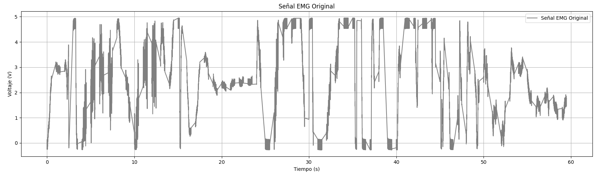
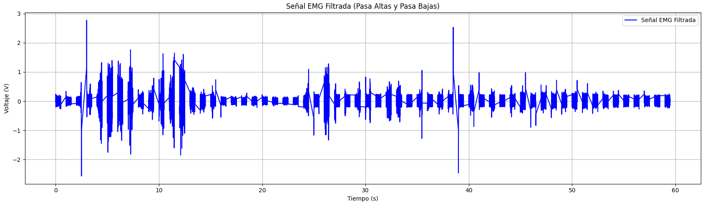

# Señales electromiográficas EMG - Filtrado digital
## Descripción
En el presente laboratorio se realiza el filtrado digital para una señal electromiografica del músculo del bicep izquierdo con el objetivo de identificar la fatiga muscular apartir del analisis espectral. Para ello, se utiliza el sistema de adquisisión de datos **DAQ** con ayuda de lenguaje de porgramación **Python**. 

El trabajo se divide en:
+ Adquisisicion de la señal.
+ Filtrado de la señal.
+ Aventanamiento.
+ Analisis espectral.
## Tener en cuenta
1. El músculo que se toma es el bicep izquierdo.
2. La duración de la adquisición es de 60 segundo.
3. La frecuencia de la señal electromiográfica *(EMG)* de un músculo puede variar entre 20 y 100 Hz, asi que utilizamos **2000Hz** para la frecuencia de muestreo.
4. Se debe instalar las librerias:
   + Nidaqmx
   + Csv.
   + Numpy.
   + Pandas.
   + Matplotlib.
   + Butter.
   + Filtfilt.
5. Se utiliza **Jupyter NoteBook** para dividir el código en partes y trabajar en ellas sin importar el orden: escribir, probar funciones, cargar un archivo en la memoria y procesar el contenido. Con lenguaje de **Python**
## 1. Adquisición de datos 
Se configura una tarea para el modulo DAQ para que reciba los datos en una frecuencia de muestreo de 2000 Hz 
```pythonimport nidaqmx
import numpy as np
import matplotlib.pyplot as plt
from collections import deque
from IPython.display import display, clear_output
import csv

# ------------------- PARÁMETROS DE ADQUISICIÓN -------------------
puerto = "Dev1/ai0"       # Cambia según tu DAQ
fmuestreo = 2000          # Frecuencia de muestreo [Hz]
t_ventana = 2000          # Muestras por iteración
duracion = 60             # Duración total [s]
ganancia = 50             # 🔹 Factor de amplificación digital (ajústalo entre 10–200)

# ------------------- BUFFERS PARA LA GRÁFICA -------------------
emg_buffer = deque([0] * t_ventana, maxlen=t_ventana)
tiempo_buffer = deque(np.linspace(0, (t_ventana - 1) / fmuestreo, t_ventana), maxlen=t_ventana)

# ------------------- ARCHIVO DE SALIDA -------------------
filename = "emg_data_amplificada.txt"

with open(filename, mode='w', newline='') as file:
    writer = csv.writer(file, delimiter='\t')
    writer.writerow(["Tiempo (s)", f"Voltaje (V) * Ganancia({ganancia}x)"])

    # ------------------- CONFIGURACIÓN DE LA TAREA -------------------
    with nidaqmx.Task() as task:
        task.ai_channels.add_ai_voltage_chan(puerto)
        task.timing.cfg_samp_clk_timing(fmuestreo)

        print(f"📡 Adquiriendo datos con ganancia digital de {ganancia}x...")
        print("Presiona 'Ctrl + C' para detener.\n")

        # Inicializar gráfico interactivo
        plt.ion()
        fig, ax = plt.subplots(figsize=(10, 4))
        line, = ax.plot(tiempo_buffer, emg_buffer, label="Señal EMG Amplificada")
        ax.set_xlabel("Tiempo (s)")
        ax.set_ylabel("Voltaje (V) (escalado)")
        ax.set_title(f"Señal EMG en Tiempo Real - Ganancia {ganancia}x")
        ax.legend()
        ax.grid(True)
        ax.set_ylim([-2, 2])  # Ajuste visual (puedes cambiarlo si tu señal crece más)

        # ------------------- BUCLE DE ADQUISICIÓN -------------------
        try:
            total_samples = int(duracion * fmuestreo)
            for i in range(0, total_samples, t_ventana):
                emg_data = task.read(number_of_samples_per_channel=t_ventana)

                if isinstance(emg_data, list):
                    # Aplicar ganancia digital
                    emg_data = np.array(emg_data) * ganancia

                    # Actualizar buffer
                    emg_buffer.extend(emg_data)

                    # Guardar datos amplificados
                    for j in range(len(emg_data)):
                        tiempo = (i + j) / fmuestreo
                        writer.writerow([tiempo, emg_data[j]])

                    # Actualizar gráfico
                    line.set_ydata(emg_buffer)
                    clear_output(wait=True)
                    display(fig)
                    plt.pause(0.01)

        except KeyboardInterrupt:
            print("\n⛔ Adquisición detenida por el usuario.")

        plt.ioff()
        plt.show()

print(f"\n✅ Archivo guardado exitosamente como '{filename}'.")
```
Esta parte del código permite almacenar los datos de 60s tomados en tiempo real y guardarlos en un archivo **.csv** para luego poder realizar un DataFrame y visualizar el voltaje y el tiempo para graficar y poder aplicar el filtro digital.
<p align="center">
    
    <br><em>Figura 1: Grafica original de la señal EMG.</em>
</p>


## 2  Filtrado de señal:

Inicialmente se extraen los datos del archivo .csv y se guardan en la variable *data*, para luego separarlo por columnas en *tiempo* y *voltaje*

```python
#  Cargar los datos desde el archivo CSV
filename = "emg_data.csv"
data = pd.read_csv(filename)
tiempos = data['Tiempo (s)'].values
voltajes = data['Voltaje (V)'].values
```
Se determinan los parametros para el filtro pasabajas  y pasa altas 
```python
fs = 2000  # Frecuencia de muestreo en Hz (asegúrate de que sea la misma que usaste para adquirir la señal)
bajaf = 20  # Frecuencia de corte para el filtro pasa altas (en Hz)
altaf = 450  # Frecuencia de corte para el filtro pasa bajas (en Hz)
```
Luego se determina los parametros para la función del filtro butterworth y poder obtener la señal filtrada como se observa en la figura.
```python
# Función para diseñar un filtro Butterworth
def butter_filter(fcorte, fs, order=4, filter_type='low'):
    nyquist = 0.5 * fs
    normal_fcorte = fcorte / nyquist
    b, a = butter(order, normal_fcorte, btype=filter_type, analog=False)
    return b, a

# Filtro Pasa Altas
b_alto, a_alto = butter_filter(bajaf, fs, order=4, filter_type='high')
pasa_altas = filtfilt(b_alto, a_alto, voltajes)

# Filtro Pasa Bajas
b_baja, a_baja = butter_filter(altaf, fs, order=4, filter_type='low')
filtrada = filtfilt(b_baja, a_baja, pasa_altas)


```
<p align="center">
    
    <br><em>Figura 2: Señal filtrada de EMG.</em>
</p>

<br><em>Figura 1: Fatiga muscular del bicep sin filtrar. mV vs t(s) .</em></p>

Luego se guarda la señal filtrada en un archivo csv para proceder con el aventanamiento y el análisis espectral
```python
# Guardar la señal filtrada en un archivo CSV
filtrada_df = pd.DataFrame({
    'Tiempo (s)': tiempos,
    'Voltaje (V)': filtrada
})

# Guardar en CSV
nombre_archivo_filtrado = "emg_filtrada.csv"
filtrada_df.to_csv(nombre_archivo_filtrado, index=False)

print(f"Archivo guardado como: {nombre_archivo_filtrado}")
```
## 3  Aventanamiento de la señal filtrada

Una vez obtenida la señal EMG filtrada, aplicamos una ventana para suavizar los bordes del fragmento de señal y evitar distorsiones en el análisis espectral. Entre las ventanas más comunes para este tipo de análisis se encuentran las ventanas *Hanning* y *Hamming*. Decidimos utilizar la ventana *Hamming*, ya que, aunque en la sección #2 se filtró la señal, aún presentaba bastante ruido posiblemente producto de músculos cercanos o interferencias eléctricas. La ventana de *Hamming* ofrece una mejor atenuación de los lóbulos laterales en comparación con la de *Hanning*, lo que permite reducir el ruido fuera de banda y mejorar la precisión del análisis en frecuencia, especialmente al aplicar la transformada rápida de Fourier (FFT).
Se deben crear tantas ventanas como número de contracciones se hicieron hasta llegar al fallo muscular, con el objetivo de comparar la señal y su espectro antes de la fatiga y durante la fatiga, lo que correspondería a la primera y última ventana. Durante los 60 segundos se contabilizaron 30 contracciones.

```python
# Cargar la señal desde el CSV

df = pd.read_csv("emg_filtrada.csv")

tiempos = df["Tiempo (s)"].values
voltajes = df["Voltaje (V)"].values

# Detectar picos (contracciones musculares)
picos, _ = find_peaks(voltajes, height=np.mean(voltajes) + 3 * np.std(voltajes), distance=300)

# Configurar ventana Hamming (200 ms)
dt = tiempos[1] - tiempos[0]
n = int(0.2 / dt)
if n % 2 == 0:
    n += 1
ventana = hamming(n)

# Aplicar ventana a los segmentos alrededor de cada pico
ventanas_aplicadas = []
tiempos_ventanas = []
for pico in picos:
    ini = pico - n // 2
    fin = pico + n // 2 + 1
    if ini >= 0 and fin <= len(voltajes):
        segmento = voltajes[ini:fin] * ventana
        ventanas_aplicadas.append(segmento)
        tiempos_ventanas.append(tiempos[ini:fin])

# Graficar la señal completa y superponer las ventanas aplicadas


plt.figure(figsize=(12, 4))
plt.plot(tiempos, filtrada, label='Señal EMG Filtrada', color='blue')


for t_vent, v_vent in zip(tiempos_ventanas, ventanas_aplicadas):
    plt.plot(t_vent, v_vent, color='orange', linewidth=2, alpha=0.7)

plt.title("Señal EMG con Ventanas de Hamming Aplicadas")
plt.xlabel("Tiempo (s)")
plt.ylabel("Voltaje (V)")
plt.grid(True)
plt.legend(["Señal EMG", "Ventanas Hamming"])
plt.tight_layout()
plt.show()
```
Se carga la señal EMG filtrada previamente guardada desde el archivo CSV y se detectan los picos que representan posibles contracciones musculares, esto con el objetivo de identificar la posición de cada contracción, utilizando un umbral basado en la media y desviación estándar de la señal. A continuación, se define una ventana de Hamming de 200 milisegundos de duración, la cual se aplica a segmentos de la señal centrados en cada pico detectado, esto permite resaltar las contracciones de forma más clara y reducir el efecto del ruido. Finalmente, se grafica sobre la señal filtrada, la señal con los segmentos aventanados para visualizar cómo se aíslan las contracciones musculares mediante el uso de ventanas.


<br><em>Figura 3: Señal aventanada Hamming superpuesta a la señal filtrada EMG. mV vs t(s) .</em></p>

Teóricamente deberíamos tener 30 ventanas, una por cada contracción esperada. Sin embargo, al usar la función find_peaks, el programa detectó lo siguiente:

```python
print("Cantidad de ventanas aplicadas:", len(ventanas_aplicadas))
```
```yaml
Cantidad de ventanas aplicadas: 24
```

Luego de observar el comportamiento de la señal EMG filtrada y compararla con la señal aventanada, procedimos a graficar esta última. En la gráfica se puede notar cómo el ruido alrededor de las contracciones prácticamente se reduce a cero, y las contracciones musculares quedan claramente aisladas. Esto confirma que la aplicación de la ventana fue efectiva para resaltar los eventos de interés y minimizar el impacto del ruido en el análisis.


<br><em>Figura 4: Señal aventanada Hamming. mV vs t(s) .</em></p>

## 4 Análisis espectral

Ahora, con la ayuda de la transformada de Fourier FFT, graficamos el espectro de frecuencias para las ventanas: 
```python
# Calcular la FFT
fft_valores = np.fft.fft(ventana_emg)
fft_frecuencias = np.fft.fftfreq(len(fft_valores), d=dt)

# Tomar la mitad positiva
mitad = len(fft_valores) // 2
magnitud = 20 * np.log10(np.abs(fft_valores[:mitad]) + 1e-12)  # evitar log(0)
frecuencias = fft_frecuencias[:mitad]

# Graficar el espectro en dB
plt.figure(figsize=(10, 4))
plt.plot(frecuencias, magnitud, color='purple')
plt.title("Espectro de frecuencia de la señal EMG aventanada")
plt.xlabel("Frecuencia (Hz)")
plt.ylabel("Magnitud (dB)")
plt.grid(True)
plt.tight_layout()
plt.show()
```


Para estimar la Densidad Espectral de Potencia (PSD), utilizamos el método de Welch, que reduce el ruido espectral al dividir la señal en segmentos, aplicar FFT y promediar los resultados. Se empleó una ventana de Hamming de 200 ms para mejorar la resolución espectral, y la PSD se representó en escala logarítmica con plt.semilogy para visualizar mejor la distribución de energía.
```python
# Calcular la Densidad Espectral de Potencia (PSD) con Welch
frecuencias, psd = welch(ventana_emg, fs=fs, window='hamming', nperseg=n)

# Graficar la PSD
plt.figure(figsize=(10, 4))
plt.semilogy(frecuencias, psd, color='green')
plt.title("Densidad espectral de potencia (PSD) de la señal EMG aventanada")
plt.xlabel("Frecuencia (Hz)")
plt.ylabel("Densidad de Potencia (V²/Hz)")
plt.grid(True, which='both', linestyle='--', alpha=0.6)
plt.tight_layout()
plt.show()
```


La mayor parte de la potencia se concentra en 20-50 Hz, donde ocurre la actividad muscular más relevante. A partir de 200 Hz, la energía disminuye progresivamente, y más allá de 600 Hz, es ya casi despreciable, lo que indica una correcta eliminación del ruido de alta frecuencia.

Para cada ventana calculamos los estadísticos descriptivos, a continuación se muestran los correspondientes a las primeras y últimas 5 ventanas:

Estadísticos descriptivos de las ventanas:

| Índice | Media     | Mediana   | Desviación estándar | Máximo   | Mínimo   |
|--------|----------|----------|----------------------|----------|----------|
| 0      | 0.001126 | 0.001406 | 0.444343             | 1.476355 | -1.341094 |
| 1      | -0.000549 | -0.016476 | 0.353636            | 1.173662 | -1.212051 |
| 2      | 0.001729 | -0.007036 | 0.236080            | 1.098923 | -1.066673 |
| 3      | -0.000147 | -0.000936 | 0.293085            | 1.070968 | -1.230842 |
| 4      | -0.001342 | -0.012649 | 0.057551            | 0.185945 | -0.367401 |

Frecuencia mediana de las primeras ventanas:

| Índice | Frecuencia mediana (Hz) |
|--------|------------------------|
| 0      | 85.9375                |
| 1      | 39.0625                |
| 2      | 39.0625                |
| 3      | 39.0625                |
| 4      | 62.5000                |

Estadísticos descriptivos de las últimas ventanas:

| Índice | Media     | Mediana   | Desviación estándar | Máximo   | Mínimo   |
|--------|----------|----------|----------------------|----------|----------|
| 20     | -0.000084 | -0.011982 | 0.114571            | 0.652389 | -0.579680 |
| 21     | 0.001169 | -0.009007 | 0.122002            | 0.651340 | -0.577998 |
| 22     | -0.002010 | -0.014697 | 0.131593            | 0.543447 | -0.376533 |
| 23     | -0.003026 | -0.020496 | 0.136900            | 0.351112 | -0.338548 |
| 24     | -0.000089 | -0.00180  | 0.017234            | 0.080661 | -0.089299 |

Frecuencia mediana de las últimas ventanas:

| Índice | Frecuencia mediana (Hz) |
|--------|------------------------|
| 20     | 62.50                  |
| 21     | 62.50                  |
| 22     | 62.50                  |
| 23     | 62.50                  |
| 24     | 31.25                  |

Se usaron las siguientes funciones para calcular los estadísticos y la frecuencia mediana respectivamente:

``` python
def calcular_estadisticos(signal):

    return {
        "Media": np.mean(signal),
        "Mediana": np.median(signal),
        "Desviación estándar": np.std(signal),
        "Máximo": np.max(signal),
        "Mínimo": np.min(signal)
    }

def calcular_frecuencia_mediana(signal, fs): #con la función Welch

    f, Pxx = welch(signal, fs=fs)
    energia_acumulada = np.cumsum(Pxx)
    energia_total = energia_acumulada[-1]
    f_mediana = f[np.where(energia_acumulada >= energia_total / 2)[0][0]]
    return f_mediana

df = pd.read_csv("emg_filtrada.csv")  
senal = df["Voltaje (V)"].values
fs = 2000  # Frecuencia de muestreo en Hz
```
Se implimentó una prueba de hipótesis para verificar si hay diferencias significativas entre la ventana de inicio y la ventana final de la señal.se realiza estre procedimeinto, ya que se plantea que a medida que progresa el tiempo y se acerca la fatiga muscular, se debe observar un cambio en las características espectrales de la señal, en particular una disminución en la frecuencia mediana de la señal EMG.Para comprobar esto, se dividió la señal en ventanas de tiempo y se compararon los datos de la primera y última ventana usando una prueba t de Student para dos muestras independientes.
``` python
from scipy.stats import ttest_ind
# -------------------------------
# Prueba de hipótesis con t-test
# -------------------------------

# Selecciona la primera y última ventana como arreglos de datos
datos_inicial = ventanas[0]
datos_final = ventanas[-1]

# Realiza el test t de muestras independientes
t_stat, p_value = ttest_ind(datos_inicial, datos_final, equal_var=False)  # Welch's t-test

# Muestra los resultados
print(f"\nEstadístico t calculado: {t_stat:.4f}")
print(f"Valor-p: {p_value:.4f}")

# Interpretación simple
alpha = 0.05
if p_value < alpha:
    print(" Hay evidencia significativa de una diferencia entre las ventanas (rechazamos H0).")
else:
    print(" No hay evidencia significativa de diferencia por lo que no se rechaza la hipotesis nula (H0).")

```
El valor-p obtenido en la prueba t de muestras independientes fue de 0.8627, que es considerablemente mayor al nivel de significancia típico de 0.05.
Por lo tanto, no se rechaza la hipótesis nula. Esto indica que no existe evidencia estadísticamente significativa de diferencia entre los datos de la primera ventana y los de la última ventana analizados.
Esto indica que no hubo un cambio relevante en las mediciones durante el experimento.
Por otra parte, aunque en la hipótesis inicial se esperaba observar una disminución de la frecuencia media como indicativo de fatiga, los resultados del test sugieren que el espectro de la señal se mantuvo relativamente constante entre las ventanas analizadas.


